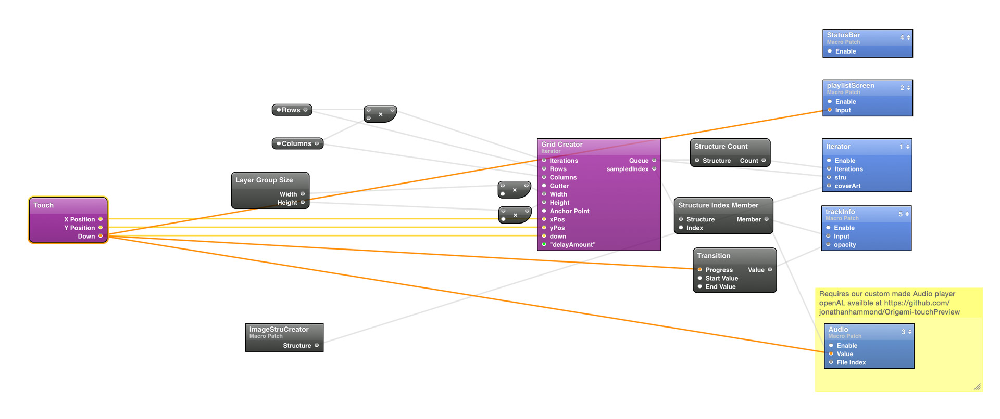
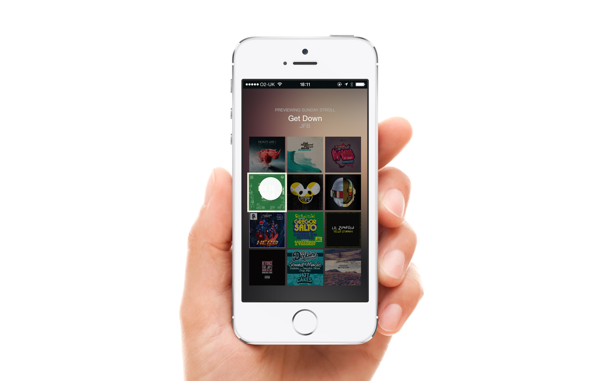
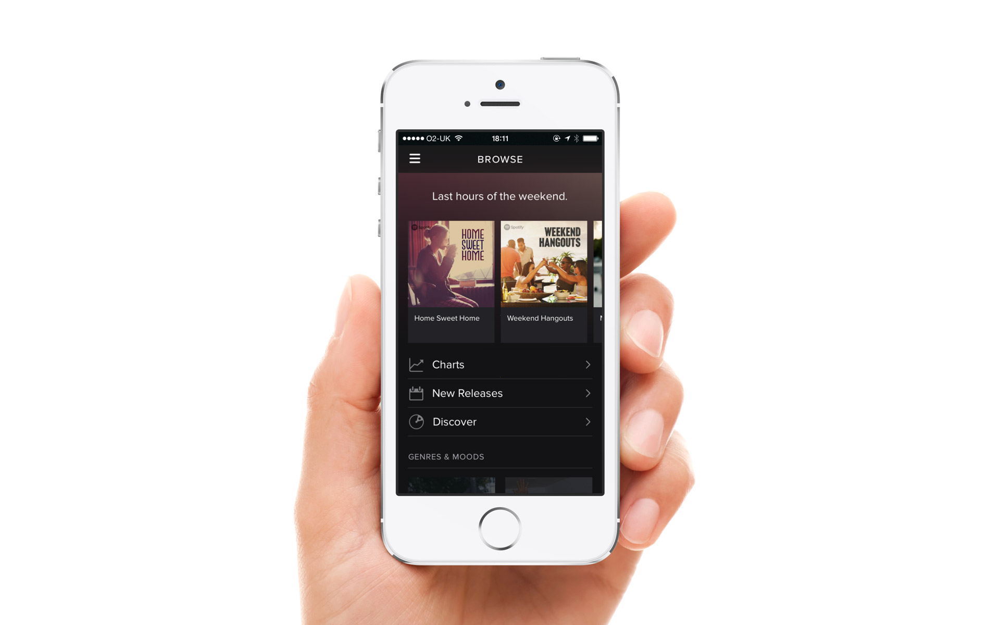

# Origami-touchPreview
Touch Preview for Origami by facebook
===========

A clone of Spotify's Touch Preview UI for the prototyping tool Origami (by Facebook)

For more examples of Facebook's Origami and Quartz Composer visit my porfolio at www.justaddmusicmedia.com

Enjoy responsibly and build something awesome! (please email me and let me know how you used it, it would be good to see)

Video Preview 
https://vimeo.com/124755561

Spotify's original touchPreview UI
https://www.youtube.com/watch?v=BriF9qxInAk

## Features
- Audio Engine
- Origami Live support
- Playlist UI

## How to Use
- Clone this repo
- Add hOz OpenAL.plugin to /Library/Graphics/Quartz Composer Plug-Ins
- Open the TouchPreview.qtz file
- Have fun!

## Dependencies
Requires [Quartz Composer](https://developer.apple.com/downloads/download.action?path=Developer_Tools%2Fgraphics_tools_for_xcode__xcode_6.1%2Fgraphicstools_for_xcode_6.1.dmg "Quartz Composer") and [Origami](http://facebook.github.io/origami/download/ "Origami") 
hOz OpenAL.plugin
## Known Issues

